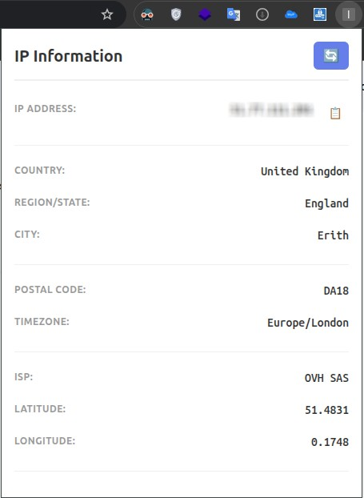

# IP Information Chrome Extension

A lightweight Chrome extension that displays your IP address and geolocation information including country, region, city, timezone, and more.

## Features

- 🌍 Displays your public IP address
- 🗺️ Shows country, region, and city
- 🕐 Displays timezone information
- 🌐 ISP/Organization information
- 📍 Latitude and longitude coordinates
- 📋 One-click copy to clipboard
- 🔄 Refresh button to update information
- ⚡ Fast and responsive UI
- 🔒 No data collection or tracking

## Installation

### Method 1: Manual Installation

1. Clone or download this repository
2. Open Chrome and go to `chrome://extensions/`
3. Enable "Developer mode" (top right corner)
4. Click "Load unpacked" 
5. Select the folder containing the extension files

### Method 2: From Chrome Web Store

(Coming soon)

## Files

- `manifest.json` - Extension configuration
- `popup.html` - User interface
- `popup.js` - Logic and API calls
- `styles.css` - Styling

## API Used

The extension uses **ipapi.co** as the primary API with **ifconfig.co** as fallback:

- **ipapi.co**: Free IP geolocation API (1,000 requests/day for free)
- **ifconfig.co**: Alternative service for reliability

## How It Works

1. When you click the extension icon, it fetches your IP information from the API
2. The data is displayed in a clean, organized popup
3. Click the 📋 button next to your IP to copy it
4. Use 🔄 button to refresh the information

## Permissions

- `activeTab` - To display the popup
- `https://ipapi.co/*` - To fetch IP geolocation data

## Privacy

- No data is stored locally
- No tracking or analytics
- All data is fetched directly from public APIs on-demand

## Troubleshooting

### Not showing IP information
- Check your internet connection
- Try clicking the refresh button
- Ensure you're not behind a proxy that blocks the API

### "Failed to fetch" error
- The API services might be temporarily unavailable
- Try again in a few moments
- Check if your ISP blocks these APIs

## Future Enhancements

- [ ] Map view with location pinning
- [ ] IP history tracking
- [ ] Dark mode
- [ ] Multiple language support
- [ ] Settings page for customization
- [ ] Network information (IPv6, DNS, etc.)

## License

MIT

## Contributing

Feel free to submit issues and enhancement requests!